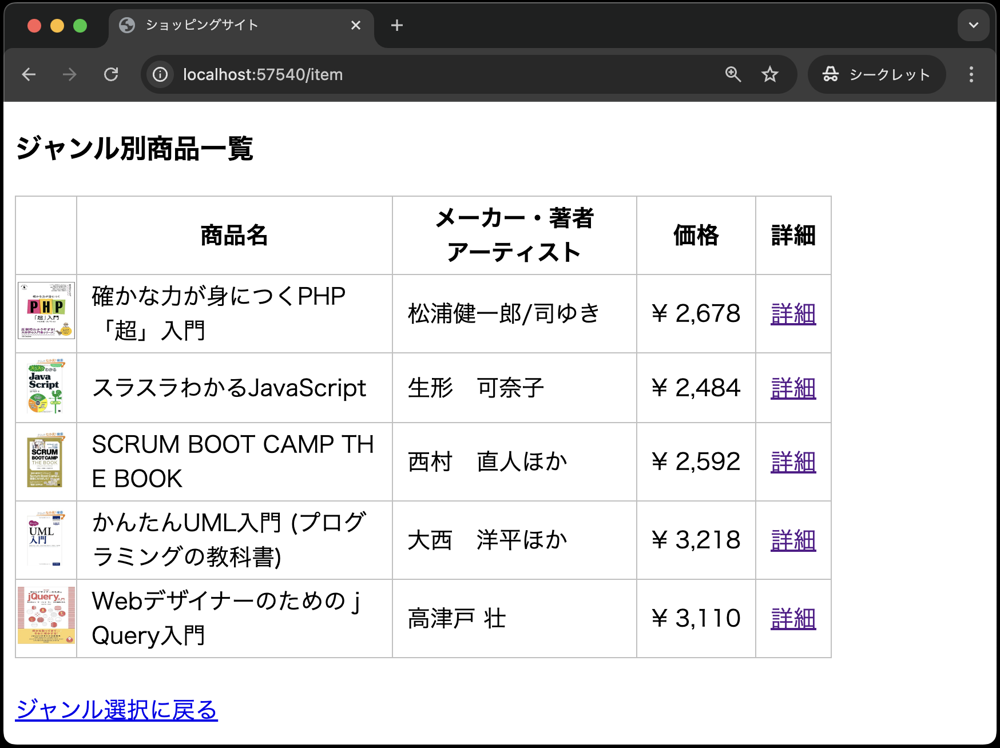
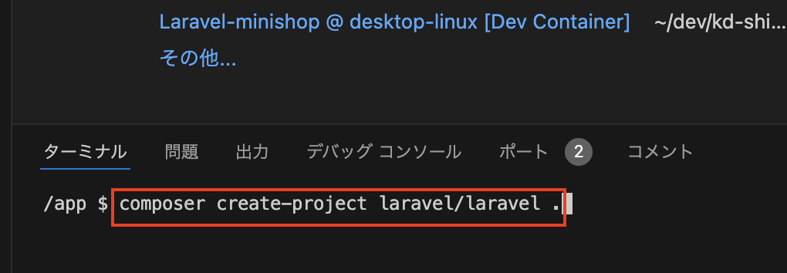
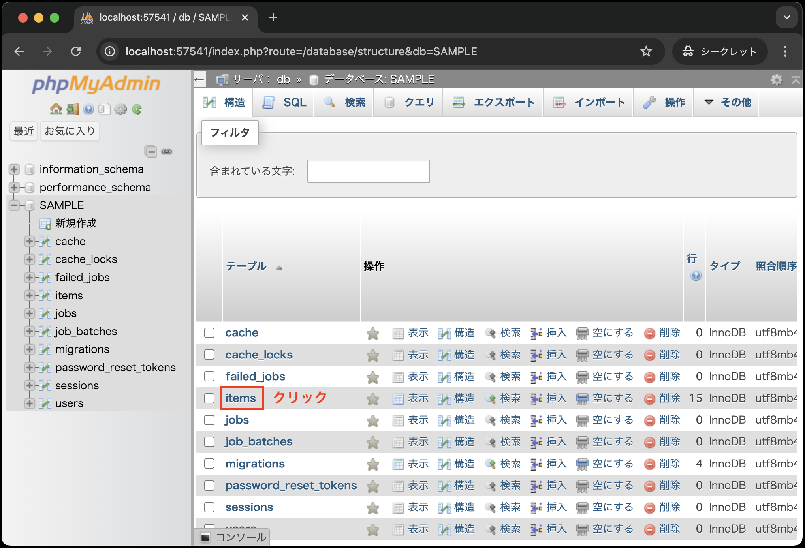
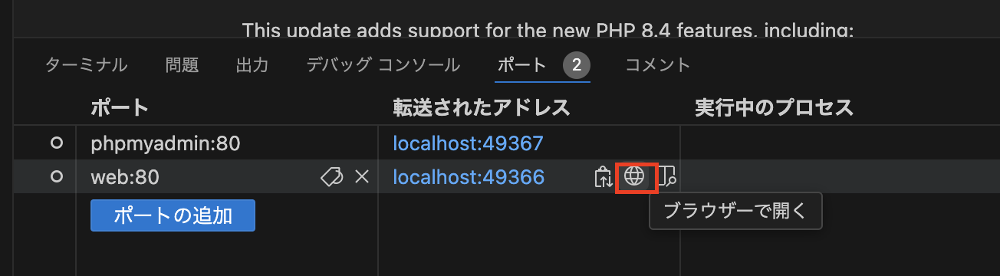
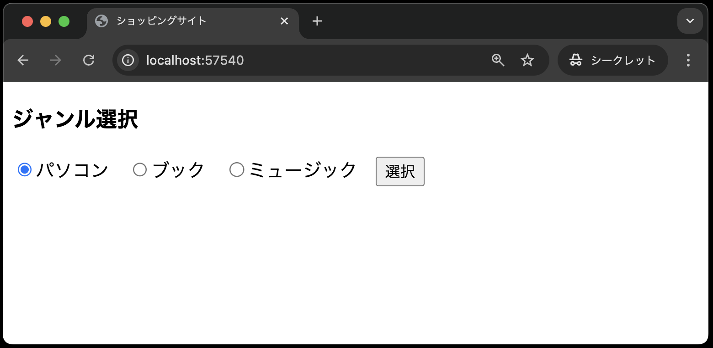
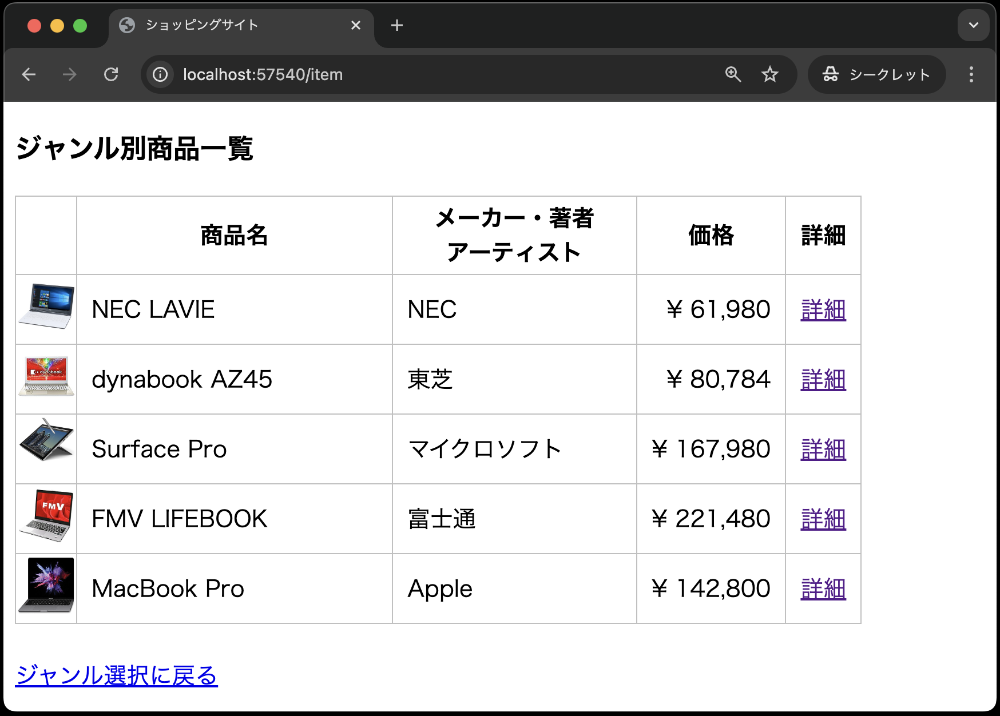
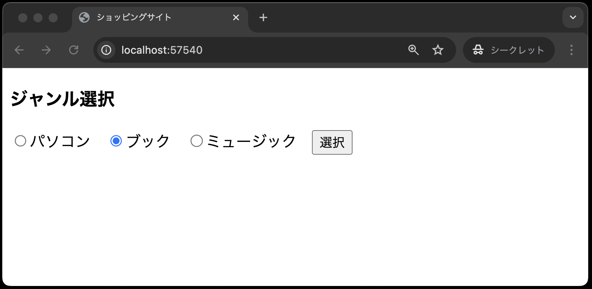
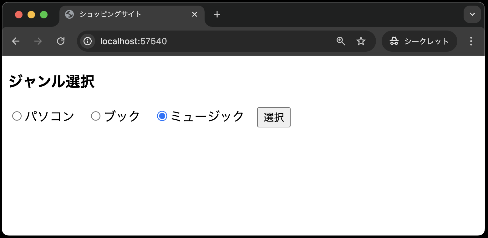
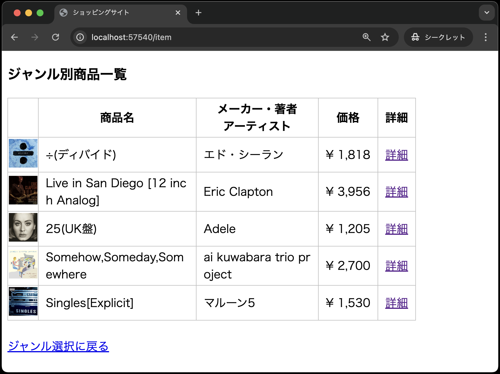

# 課題の説明

以下に、ジャンル別商品一覧画面の仕様を再掲します。



- 選択されたジャンルの商品概要を一覧で表示する
- 各商品にはそれぞれの商品詳細画面へのリンクがある(※本課題では商品詳細画面のルーティングを設定しないので、リンク先は空欄とする)

以上の仕様を満たすジャンル選択画面を以下の手順で作成してください。

## ①Laravel環境の構築

1. VSCode上で、`Ctrl+Shift+P`(Macの場合は`Cmd+Shift+P`)を押し、コンテナを起動する
2. VSCode上で、`Ctrl+J`(Macの場合は`Cmd+J`)を押し、ターミナルを表示する
3. ターミナルに`composer create-project laravel/laravel .` と入力し、`Enter`で実行する<br>
   
4. [【課題】ジャンル選択画面の作成](https://2025web2.github.io/21-asgmt-shop-index-text/)で作成した以下のコードを、上記「1.」でcloneしたソースコードと同じ場所に上書きする
   
   ```text
    app
    │
    途中省略
    │
    resources
    ├── views 
    │   └── index.blade.php
    routes
    └── web.php
    ```

5. [モデル、コントローラ](https://2025web2.github.io/02-model-controller/)の章と同様に、`items`テーブルを作成し、データを挿入する(※手順はあえて書いてないので、頑張ってトライしてみましょう！)
6. phpmyadminで`items`テーブルが確認できればOK<br>
   <br>
   <br>
   

## ②ルーティングの修正

前回の[【課題】ジャンル選択画面の作成](https://2025web2.github.io/21-asgmt-shop-index-text/)では送信ボタンを押した後のルーティングが設定されていませんでした。
まずは、送信ボタンを押した後のルーティングを設定しましょう。

本課題でも、[モデル、コントローラ](https://2025web2.github.io/02-model-controller/)の章同様、以降で`ItemController`を作成し,商品の一覧を表示するための`index`メソッドを作成します。

ですので、まずはジャンル選択画面の送信ボタンを押した場合、`ItemController`の`index`メソッドを呼び出すようにルーティングを設定しましょう。

`routes/web.php`を以下のように修正してください。
※[モデル、コントローラ](https://2025web2.github.io/02-model-controller/)の章で解説していないものありますので、解説を読みながら進めてください。

```php
<?php

use Illuminate\Support\Facades\Route;
use App\Http\Controllers\ItemController; // 追加(忘れずに！)

Route::get('/', function () {
    return view('index');
})->name('index');

// --- 以下を追加 ---
Route::post('item', [ItemController::class, 'index'])->name('item.index');
// --- ここまで ---
```

**【解説】**

`Route::post('item', [ItemController::class, 'index'])->name('item.index');`:<br>

`Route::post`メソッドは、`POST`リクエストを受け取るルーティングを設定します。
ジャンル別選択画面の送信ボタンを押すと、`POST`リクエストが送信されるため、`POST`リクエストを受け取るルーティングを設定します。

第1引数には、URLを指定し、`item`となっています。
第2引数には、コントローラを指定します。
こちらは、[モデル、コントローラ](https://2025web2.github.io/02-model-controller/)の章で説明しているので割愛します。

`->name('item.index')`:<br>
`->name`メソッドは、ルートに名前を付けるためのメソッドです。
これがビューなどからルートを参照する際に、URLを直接記述するのではなく、名前を使って参照することができるようになります。
この課題で初めてその恩恵を受けることができます。

## ③ジャンル選択画面の修正

次に、ジャンル選択画面(`resources/views/index.blade.php`)を修正します。

先ほど述べた`->name('item.index')`の恩恵を受けましょう！
ルーティングにつけた名前を使い、`<form>`タグの`action`属性を以下のように修正してください。

```php
<!DOCTYPE html>
<html lang="ja">

<!-- 途中省略 -->

<body>
<h3>ジャンル選択</h3>
<!-- 以下のaction属性を修正 -->
<form method="POST" action="{{ route('item.index') }}">
<!-- ここまで -->
    @csrf
    <label><input type="radio" name="genre" value="pc">パソコン</label>&nbsp;&nbsp;
    <label><input type="radio" name="genre" value="book" checked>ブック</label>&nbsp;&nbsp;
    <label><input type="radio" name="genre" value="music">ミュージック</label>&nbsp;&nbsp;
    
<!-- 以下省略 -->
```

**【解説】**

`<form method="POST" action="{{ route('item.index') }}">`:<br>
`<form>`タグの`action`属性には、ルーティングにつけた名前を指定します。
ルーティングの名前を使用する関数として、ここでは`route`関数を使い、`item.index`という名前のルートを指定しています。
なお、ビューで関数を使用する場合は、`{{ }}`で囲む必要があります。


これにより、直接的にURLを記述せずとも、名前をつけることでより感覚的にルーティングを指定することができます。

これで、ジャンル選択画面の修正が完了し、送信ボタンを押すと、`ItemController`の`index`メソッドが呼び出されるようになりました。

## ④モデルの作成

[モデル、コントローラ](https://2025web2.github.io/02-model-controller/)の章と同様に、`Item`モデルを作成してください。
あえて手順は書いていませんので、前章を参考、頑張ってトライしてみてください！

## ⑤コントローラの作成

1. [モデル、コントローラ](https://2025web2.github.io/02-model-controller/)の章を参考に、`ItemController`を作成する
2. 以下のように、`ItemController`の`index`メソッドを作成する

    ```php
    <?php
    namespace App\Http\Controllers;

    use Illuminate\Http\Request;
    use App\Models\Item; // 追加

    class ItemController extends Controller
    {
        // --- 以下を追加 ---
        public function index(Request $request)
        {
            $items = Item::where('genre', $request->genre)->get();
            return view('item.index', ['items' => $items]);
        }
        // --- ここまで ---
    }
    ```

**【解説】**

一部、[モデル、コントローラ](https://2025web2.github.io/02-model-controller/)の章で説明していない部分がありますので、解説を読みながら進めてください。

`Request $request`: <br>
`Request`クラスは、あらかじめ定義されているHTTPリクエストを表すクラスです。

---

**【補足】**

`Request $request`と記述することにより、`new`を使わずにクラスから`$request`オブジェクトを使うことができます。

PHPでは、メソッド内に`$request = new Request();`と記述していたのが、Laravelでは、メソッドの**引数に**`Request $request`と記述するだけで、`$request`オブジェクトを使うことができます。

`$request`オブジェクトにより、リクエスト時に`GET`・`POST`リクエストを使って送られたデータを取得することができ、非常に便利です。

以降の章でも出てきますが、このようにメソッドの引数にクラスとそのオブジェクトを記述する方法は、**依存性の注入**と呼ばれ、Laravelの特徴の1つです。
メリットとしては、コードの見通しが良くなる、テストしやすくなる、再利用性が高まるなどがあります。

---

`$items = Item::where('genre', $request->genre)->get();`: <br>

`Item::where('genre', $request->genre)`は、いわゆるSQL文の`WHERE`句に相当する処理です。
`Item`モデルの`genre`カラムが、リクエスト時に送られた`genre`の値と一致するレコードを取得します。
`->get()`は、`where`メソッドで取得したレコードを取得します。

`return view('item.index', ['items' => $items]);`: <br>
[モデル、コントローラ](https://2025web2.github.io/02-model-controller/)の章ではビューにデータを渡す際に、`compact`関数を使いましたが、ここでは連想配列を使ってデータを渡しています。
どちらも利用されますので、この機会に覚えておくと良いでしょう。

## ⑥ジャンル別商品一覧画面の作成

作成する場所ですが、ジャンル別商品一覧画面は、アプリケーション「ミニショップ」の**商品機能**に関するビューになるため、`resources/views/item` ディレクトリに配置します。
以下の手順で作成してください。


- **「Googleのクラスルーム」→「授業タブ」→「Laravel資料」→「cssと画像ファイル」の元データがあるのでダウンロードする**
- `public`ディレクトリに`images`ディレクトリを作成し、ダウンロードした画像ファイルを配置する
- `public`ディレクトリに`css`ディレクトリを作成し、ダウンロードしたcssファイルを配置する
- `resources/views` ディレクトリに `item` ディレクトリを作成する
- `item` ディレクトリに `index.blade.php` ファイルを作成する(Laravelではビューを作成するコマンドがないので、手動で作成すること)
- `index.blade.php` にコードを記述する
   - コードは前期の[仕様書①：ジャンル選択画面、ジャンル別商品一覧画面](https://2025web1.github.io/11-minishop-product/item-1.html#%E3%82%B8%E3%83%A3%E3%83%B3%E3%83%AB%E5%88%A5%E5%95%86%E5%93%81%E4%B8%80%E8%A6%A7%E7%94%BB%E9%9D%A2product_selectphp)の`product_select.php`を参考にし、[モデル、コントローラ](https://2025web2.github.io/02-model-controller/)の章で学んだ内容を反映させること
       - `foreach`ディレクティブを使って、商品データを表示する
       - 商品データは、ItemControllerの`index`メソッドで取得した`$items`を使う
       - 「詳細」リンクについては、ルーティング設定ができていないので、空欄(`<a href="">`)にする
       -  cssファイルを読み込む場合は、`<link rel="stylesheet" href="{{ asset('css/minishop.css')}}">`を使用する
       -  画像ファイルを表示するには、`image )}}">`を使用する
       -  「ジャンル選択に戻る」リンクには、ルーティングでつけた`index`の名前を使用する

**【解説】**

`<link rel="stylesheet" href="{{ asset('css/minishop.css')}}">`: <br>
`image )}}">`: <br>
Laravelでは、ビューでcssファイルや画像ファイルを読み込む際に、`asset`関数を使います。
`asset`関数は、`public`ディレクトリのパスを返す関数であり、`public`ディレクトリ内のファイルを読み込む際に使用します。


## ⑦動作確認

これで、ジャンル選択画面からジャンルを選択し、リクエストを送信すると、選択したジャンルに応じた商品一覧画面が表示されるようになりました。

では、実際に動作確認を行いましょう。

1. VSCode上で、`Ctrl+Shift+P`(Macの場合は`Cmd+Shift+P`)を押し、コンテナを起動する(既に起動しているなら不要)
2. VSCode上で、`Ctrl+J`(Macの場合は`Cmd+J`)を押し、画面下部のポートをクリックし、地球儀マークをクリックする<br>
   
3. ブック、パソコン、ミュージックそれぞれの一覧が表示されればOK
   
   
    
    
    
    
